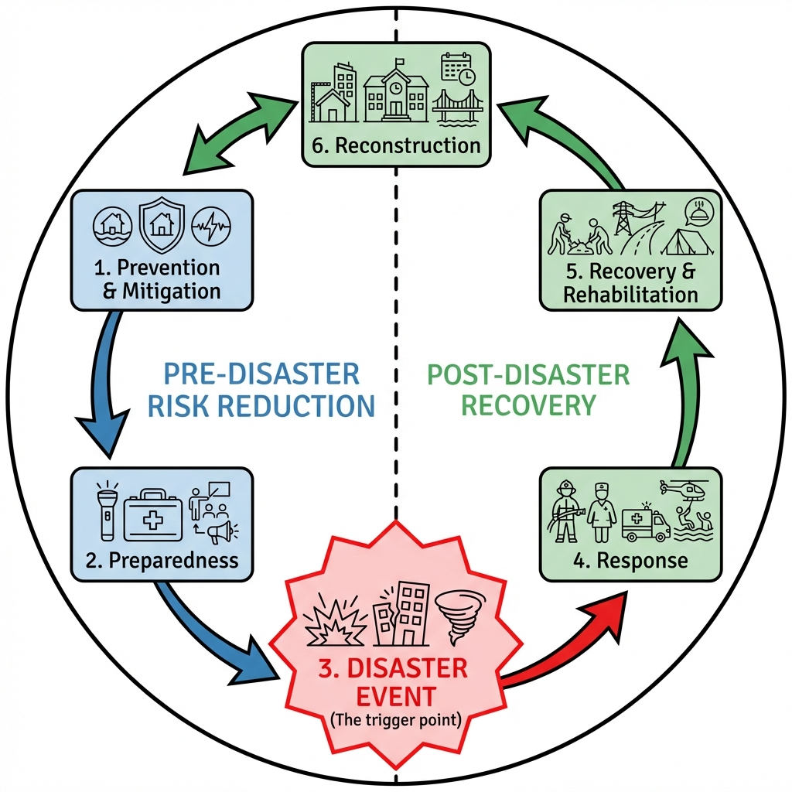

# Concept of Hazards, Disasters, and Risk Management: Foundations of DRR by Pulakesh Pradhan

## Introduction

In the field of Disaster Management, clarity of terminology is not merely academic—it is a matter of life and death. The way we define "hazard" versus "disaster" dictates how we allocate resources, design policies, and engineer our cities. For decades, humanity treated disasters as "Acts of God"—random, unavoidable events. Today, we understand that while hazards may be inevitable, disasters are not.

This document explores the fundamental concepts that form the bedrock of modern **Disaster Risk Reduction (DRR)**, tracing the evolution of these ideas from simple relief mechanisms to complex risk management frameworks mandated by international agreements like the Sendai Framework.

---

*Fig 1: The relationship between Hazard (Event), Vulnerability (Weakness), and Disaster (Outcome).*

---

## 1. The Concept of Hazard

### Definition

A **Hazard** is a process, phenomenon, or human activity that may cause loss of life, injury or other health impacts, property damage, social and economic disruption, or environmental degradation.

* **Etymology:** The word comes from the Old French *hasard* (a game of dice) and the Arabic *az-zahr* (the die), implying an element of chance.
* **Nature:** A hazard is a **potential** threat. It is a condition that exists in the environment. For example, a fault line is a hazard; a chemical factory is a hazard.

### Attributes of a Hazard

To understand a hazard, scientists analyze its physical characteristics:

1. **Magnitude/Intensity:** How strong is it? (e.g., Richter scale for earthquakes, Saffir-Simpson scale for hurricanes).
2. **Frequency:** How often does it occur? (Return period, e.g., "1-in-100 year flood").
3. **Duration:** How long does it last? (A few seconds for an earthquake vs. years for a drought).
4. **Areal Extent:** How large an area does it cover? (Local vs Trans-boundary).
5. **Speed of Onset:** Is it sudden (earthquake, flash flood) or slow (drought, desertification)?
6. **Predictability:** Can we forecast it? (High for Cyclones, Low for Earthquakes).

---

## 2. The Concept of Disaster

### Definition

A **Disaster** is a serious disruption of the functioning of a community or a society at any scale due to hazardous events interacting with conditions of exposure, vulnerability, and capacity, leading to one or more of the following: human, material, economic, and environmental losses and impacts.

### Legal Definition in India (DM Act, 2005)

Section 2(d) of the Disaster Management Act, 2005 defines a disaster as:

> "A catastrophe, mishap, calamity or grave occurrence in any area, arising from natural or man made causes, or by accident or negligence which results in substantial loss of life or human suffering or damage to, and destruction of, property, or damage to, or degradation of, environment, and is of such a nature or magnitude as to be beyond the **coping capacity** of the community of the affected area."

### The Crucial Distinction

The most critical phrase in the definition is **"beyond the coping capacity."**

* **Scenario A (Hazard):** A Category 5 cyclone hits an uninhabited island. Trees fall, but no one dies. This is a natural phenomenon.
* **Scenario B (Emergency):** A Category 5 cyclone hits a prepared city like Tokyo. Some windows break, but services run. This is manageble.
* **Scenario C (Disaster):** A Category 5 cyclone hits a slum in a delta region with poor housing and no warning system. Thousands die. This is a disaster.

---

## 3. The Disaster Risk Equation

Modern disaster management is driven by a mathematical understanding of risk. The relationship is expressed as:

$$ \text{Risk (R)} = \frac{\text{Hazard (H)} \times \text{Exposure (E)} \times \text{Vulnerability (V)}}{\text{Capacity (C)}} $$

### Component Breakdown

#### 1. Hazard (H)

* **The Trigger:** The external event (e.g., Earthquake, Flood).
* **Reduction:** We often cannot reduce the hazard itself (we can't stop the earth from shaking), but we can mitigate man-made hazards.

#### 2. Exposure (E)

* **The Presence:** People, infrastructure, housing, production capacities, and other tangible human assets located in hazard-prone areas.
* **Example:** Building a hotel on a beach (High Exposure) vs. building it 5km inland (Low Exposure).

#### 3. Vulnerability (V)

* **The Weakness:** The characteristics and circumstances of a community, system, or asset that make it susceptible to the damaging effects of a hazard.
* **Types:**
  * **Physical:** Weak buildings, poor dykes.
  * **Social:** Poverty, gender inequality, caste discrimination.
  * **Economic:** Heavy reliance on a single sector (e.g., agriculture).

#### 4. Capacity (C)

* **The Strength:** The combination of all the strengths, attributes, and resources available within a community to manage and reduce disaster risks.
* **Examples:** Warning systems, trained volunteers, earthquake-resistant codes, insurance.
* **Mathematical Role:** Since Capacity is in the denominator, **increasing capacity significantly reduces risk**, even if the hazard remains severe.

---

## 4. The Paradigm Shift: From Relief to Risk Reduction

The approach to disaster management has undergone a radical transformation over the last 50 years.

### Phase 1: The Relief-Centric Approach (Pre-1990s)

* **Philosophy:** Disasters are "Acts of God." We cannot stop them.
* **Focus:** Post-disaster response. Distribution of food, blankets, and compensation.
* **Shortcoming:** It was a reactive "cycle of destruction and reconstruction." Money was spent on repairing the same damage repeatedly without addressing the root cause.

### Phase 2: The IDNDR Decade (1990-1999)

* **Event:** UN declared the 1990s as the **International Decade for Natural Disaster Reduction (IDNDR)**.
* **Shift:** Recognition that technology and engineering (dams, walls, satellites) could reduce the impact.
* **Outcome:** The **Yokohama Strategy (1994)** was the first international blueprint for DRR.

### Phase 3: The Hyogo Framework for Action (2005-2015)

* **Philosophy:** "Building the Resilience of Nations and Communities."
* **Focus:** Integration of DRR into development policies. Recognition that **development causes disasters** (e.g., filling wetlands for real estate causes flooding).
* **Action:** Establishment of National Platforms (like NDMA in India).

### Phase 4: The Sendai Framework (2015-2030)

* **Philosophy:** "Managing Risk, not just Disasters."
* **Focus:** **Build Back Better**. Understanding disaster risk.
* **Goal:** Substantial reduction of disaster risk and losses in lives, livelihoods, and health.

---

## 5. The Disaster Management Cycle

Disaster Management is not a linear event but a continuous cycle divided into three major phases.

### A. Pre-Disaster Phase (Risk Reduction)

1. **Prevention:** Activities to completely avoid the adverse impact of hazards (e.g., Land-use regulations banning building in flood zones).
2. **Mitigation:** Structural and non-structural measures to limit the adverse impact (e.g., Retrofitting buildings, mangrove plantation).
3. **Preparedness:** Knowledge and capacities to anticipate, respond to, and recover from impacts (e.g., Mock drills, stockpiling supplies, EWS).

### B. During Disaster Phase (Emergency Response)

1. **Response:** Immediate actions taken before, during, or after a disaster to save lives and property (e.g., Search and Rescue, First Aid, Evacuation, Triage).

### C. Post-Disaster Phase (Recovery)

1. **Rehabilitation:** Restoration of basic services and facilities (e.g., restoring power, temporary housing, reopening schools).
2. **Reconstruction:** Full restoration of all services and infrastructure to equal or better standards.
3. **Recovery:** Long-term process of restoring the community to a "new normal," often better than before (**Build Back Better**).

---

## 6. Classification of Disaster Levels

In India, the High Power Committee (HPC) on Disaster Management has standardized the levels of disasters to streamline the response mechanism.

| Level | Description | Responsibility |
| :--- | :--- | :--- |
| **L0** | **Normal Time:** No disaster. Focus on surveillance, continuous training, capacity building, and preparedness (drills). | District/State/Center |
| **L1** | **District Level:** A disaster that can be managed within the capabilities of the district administration. | District Disaster Management Authority (DDMA) |
| **L2** | **State Level:** A disaster that overwhelms the district's capacity and requires state assistance and mobilization of state resources. | State Disaster Management Authority (SDMA) |
| **L3** | **National Level:** A catastrophic event that overwhelms the state's capacity, requiring central intervention and international aid. | National Disaster Management Authority (NDMA) / NEC |
| **L3** | **International Level:** Assistance required from UN/Other nations. | International Community |

*Note: There is no legal definition of a "National Disaster" in the DM Act, 2005. L3 is an operational classification used for mobilizing National Disaster Response Force (NDRF).*

---

## 7. Global Trends and Statistics

Why is the shift to Risk Reduction necessary? The data speaks for itself.

### Trends in Disaster Frequency (1970-2019)

According to the **UNDRR and CRED (Centre for Research on the Epidemiology of Disasters)** report "Human Cost of Disasters":

* **Increase:** The number of recorded disasters has nearly **doubled** in the last 20 years.
* **Climate Drivers:** 90% of all major disasters are weather-related (Floods, Storms, Heatwaves).

### Economic Impact vs. Human Lives

There is a diverging trend between developed and developing nations:

* **Developing Nations:** Suffer higher **mortality** (Deaths). They lack the **Capacity** to protect people.
* **Developed Nations:** Suffer higher **economic losses** (Assets). They have high **Exposure** of expensive infrastructure.

*Example:* A magnitude 7.0 earthquake in **Haiti (2010)** killed 220,000 people. A magnitude 9.0 earthquake in **Japan (2011)** killed 19,000. This 10x difference in fatality despite a 1000x difference in energy release (Richter scale is logarithmic) proves that **Capacity** defines the disaster, not the Hazard.

---

## 📝 Self Assessment

### Multiple Choice Questions

1. **Which equation correctly represents the modern understanding of Disaster Risk?**
    

    
Click to show Options

    a) Risk = Hazard + Vulnerability 
    b) Risk = (Hazard × Vulnerability) / Capacity 
    c) Risk = Hazard - Capacity 
    d) Risk = Vulnerability × Exposure 
    

    

    
Click to show Answer

    **Correct Answer:** b) Risk = (Hazard × Vulnerability) / Capacity
    

2. **Which phase of the Disaster Management Cycle involves "Build Back Better"?**
    

    
Click to show Options

    a) Mitigation 
    b) Response 
    c) Recovery 
    d) Preparedness 
    

    

    
Click to show Answer

    **Correct Answer:** c) Recovery
    

3. **The "L3" level of disaster corresponds to which administrative scale?**
    

    
Click to show Options

    a) District Level 
    b) Block Level 
    c) State Level 
    d) National Level 
    

    

    
Click to show Answer

    **Correct Answer:** d) National Level
    

4. **Who defined the 1990s as the "International Decade for Natural Disaster Reduction" (IDNDR)?**
    

    
Click to show Options

    a) The World Bank 
    b) The United Nations 
    c) The Red Cross 
    d) The Government of India 
    

    

    
Click to show Answer

    **Correct Answer:** b) The United Nations
    

5. **In the Risk Equation, "Exposure" refers to:**
    

    
Click to show Options

    a) The internal weakness of a building. 
    b) The strength of the earthquake. 
    c) The assets (people/property) present in the hazard zone. 
    d) The knowledge of the community. 
    

    

    
Click to show Answer

    **Correct Answer:** c) The assets (people/property) present in the hazard zone.
    

6. **"Retrofitting a school building to withstand earthquakes" is an example of:**
    

    
Click to show Options

    a) Response 
    b) Mitigation 
    c) Recovery 
    d) Relief 
    

    

    
Click to show Answer

    **Correct Answer:** b) Mitigation
    

7. **According to the DM Act 2005, a disaster exists when the impact is:**
    

    
Click to show Options

    a) Expensive to repair. 
    b) Beyond the coping capacity of the community. 
    c) Caused by human negligence. 
    d) Reported in the news. 
    

    

    
Click to show Answer

    **Correct Answer:** b) Beyond the coping capacity of the community.
    

8. **Which framework introduced the goal of "Substantially reducing disaster risk and losses" for 2015-2030?**
    

    
Click to show Options

    a) Yokohama Strategy 
    b) Hyogo Framework 
    c) Sendai Framework 
    d) Paris Agreement 
    

    

    
Click to show Answer

    **Correct Answer:** c) Sendai Framework
    

9. **A "Hazard" with zero "Vulnerability" results in:**
    

    
Click to show Options

    a) High Risk 
    b) Zero Risk 
    c) A Disaster 
    d) An Emergency 
    

    

    
Click to show Answer

    **Correct Answer:** b) Zero Risk
    

10. **The shift from "Relief-Centric" to "Prevention-Centric" occurred primarily because:**
    

    
Click to show Options

    a) Relief became too expensive. 
    b) It was realized that development often creates new risks. 
    c) Donors stopped giving money. 
    d) Technology made weather prediction perfect. 
    

    

    
Click to show Answer

    **Correct Answer:** b) It was realized that development often creates new risks.
    

### Descriptive Questions

1. **Explain the logic behind the statement: "There is no such thing as a natural disaster."**
    

    
Click to see Key Points

    *   **Core Argument:** Nature provides the "Hazard (e.g., rain, wind, quake)."
    *   **Human Factor:** Humans create the "Vulnerability (e.g., poor housing, building in floodplains)."
    *   **Conclusion:** A disaster only occurs when the human system fails to cope with the natural event. Therefore, the *disaster* is a social/human construct, not a natural one.
    

2. **Describe the operational levels of disaster management (L0 to L3) in India.**
    

    
Click to see Key Points

    *   **L0 (Normal):** Focus on prevention and training.
    *   **L1 (District):** Managed by DDMA.
    *   **L2 (State):** Managed by SDMA (requires state resources).
    *   **L3 (National):** Catastrophic event requiring Central/International aid (NDMA coordinates).
    

