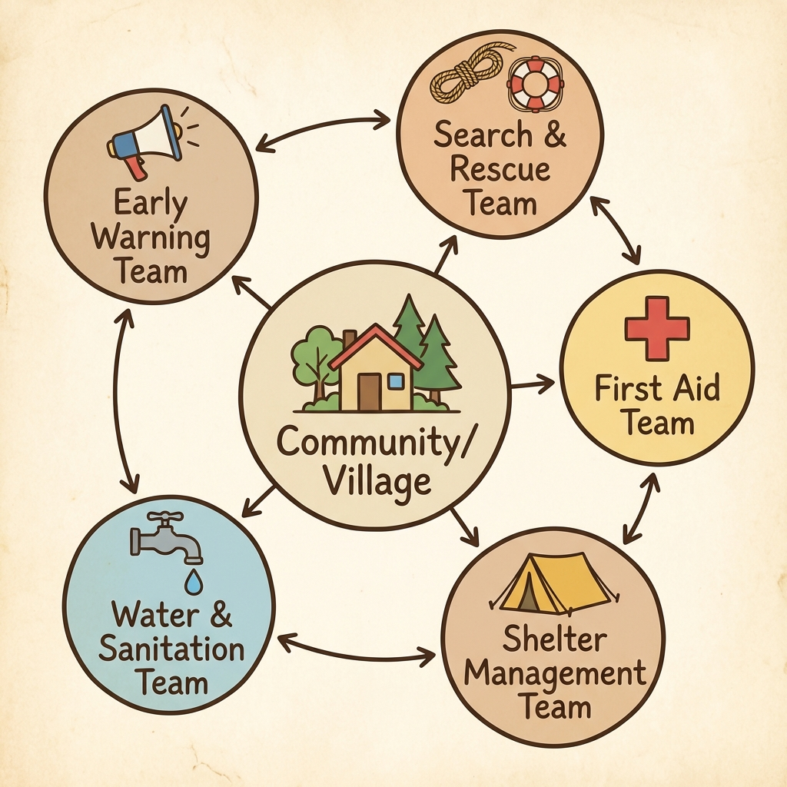

# Community Based Disaster Preparedness

Community Based Disaster Management (CBDM) is an approach that promotes the involvement of the community in disaster risk management.

## Why Community?
>
> **Hyogo Framework for Action:** Identified community participation as a key priority.

* **Local Knowledge:** Communities know their own vulnerabilities.
* **First Responders:** Neighbors help neighbors.

## Key Components

### 1. Community Risk Assessment

* **Participatory Rural Appraisal (PRA):** Tools used to map hazards.
* *Link:* [CBDM Manual by NIDM](https://nidm.gov.in/PDF/modules/CBDM.pdf)

### 2. Task Forces & VDMCs

* **Village Disaster Management Committee (VDMC):** The local body responsible for planning.
* Task Forces: Search & Rescue, First Aid, Shelter Management.

*Fig 1: Structure of a Community Based Disaster Preparedness Team.*

### 3. Mock Drills & Awareness

* Regular practice is essential.
* *Resource:* [Do's and Don'ts by NDMA](https://ndma.gov.in/Natural-Hazards/Do-Dont)

## Case Studies

* **Cyclone Shelters in Bangladesh & India:** The management of cyclone shelters by local communities has drastically reduced death tolls.
  * *Article:* [Community Resilience in Coastal Odisha](https://www.undp.org/india/our-focus/environment-and-energy/disaster-risk-management)

---

## 📝 Self Assessment

### Multiple Choice Questions

1. **In Disaster Management, who are considered the "First Responders"?**
    

    
Click to show Options

    a) The National Army 
    b) The Community members 
    c) The Police Force 
    d) International NGOs 
    

    

    
Click to show Answer

    **Correct Answer:** b) The Community members
    

2. **CBDM stands for:**
    

    
Click to show Options

    a) Central Bureau of Disaster Management 
    b) Community Based Disaster Management 
    c) Common Building Design Manual 
    d) Coastal Belt Disaster Mitigation 
    

    

    
Click to show Answer

    **Correct Answer:** b) Community Based Disaster Management
    

3. **PRA, a tool used for community risk assessment, stands for:**
    

    
Click to show Options

    a) Public Rescue Action 
    b) Participatory Rural Appraisal 
    c) Primary Risk Assessment 
    d) Public Relief Agency 
    

    

    
Click to show Answer

    **Correct Answer:** b) Participatory Rural Appraisal
    

4. **The "Hyogo Framework for Action" highlighted the importance of:**
    

    
Click to show Options

    a) Nuclear proliferation. 
    b) Community participation in DRR. 
    c) Space exploration. 
    d) Deep sea mining. 
    

    

    
Click to show Answer

    **Correct Answer:** b) Community participation in DRR.
    

5. **Which of the following is NOT a typical Village Task Force?**
    

    
Click to show Options

    a) Search and Rescue Team 
    b) First Aid Team 
    c) Shelter Management Team 
    d) Missile Launch Team 
    

    

    
Click to show Answer

    **Correct Answer:** d) Missile Launch Team
    

6. **VDMC stands for:**
    

    
Click to show Options

    a) Village Disaster Management Committee 
    b) Virtual Disaster Monitoring Center 
    c) Very Dangerous Monsoon Cyclone 
    d) Volunteer Doctors Medical Corps 
    

    

    
Click to show Answer

    **Correct Answer:** a) Village Disaster Management Committee
    

7. **Why is "Local Knowledge" important in CBDM?**
    

    
Click to show Options

    a) It is cheaper than scientific data. 
    b) Locals know distinct historical patterns and vulnerabilities of their area. 
    c) It replaces the need for government help. 
    d) It is the only way to predict earthquakes. 
    

    

    
Click to show Answer

    **Correct Answer:** b) Locals know distinct historical patterns and vulnerabilities of their area.
    

8. **The safety action "Drop, Cover, and Hold On" is specific to:**
    

    
Click to show Options

    a) Floods 
    b) Earthquakes 
    c) Cyclones 
    d) Fires 
    

    

    
Click to show Answer

    **Correct Answer:** b) Earthquakes
    

9. **Who manages Cyclone Shelters in the CBDM model?**
    

    
Click to show Options

    a) The Prime Minister 
    b) The Shelter Management Committee (local community) 
    c) The District Collector only 
    d) Private security firms 
    

    

    
Click to show Answer

    **Correct Answer:** b) The Shelter Management Committee (local community)
    

10. **Community preparedness ensures that:**
    

    
Click to show Options

    a) Disasters never happen. 
    b) The impact of disasters is reduced through timely local action. 
    c) The government doesn't need to do anything. 
    d) Everyone becomes a doctor. 
    

    

    
Click to show Answer

    **Correct Answer:** b) The impact of disasters is reduced through timely local action.
    

### Descriptive Questions

1. **Why is the community considering the most critical stakeholder in disaster management?**
    

    
Click to see Key Points

    *   **Proximity:** They are always present when the event strikes.
    *   **Response Time:** External help takes time (gap period); the community acts within minutes.
    *   **Knowledge:** They understand the local terrain and high-risk households better than outsiders.
    

2. **Listing three common Task Forces formed at the village level and their functions.**
    

    
Click to see Key Points

    *   **Early Warning Team:** Listens to radio/news and spreads alerts (megaphones/sirens).
    *   **Search & Rescue Team:** Trained to rescue people from debris or water.
    *   **First Aid Team:** Provides initial medical care before doctors arrive.
    *   *(Optional)* Shelter Management Team: Maintains hygiene and food in shelters.
    

