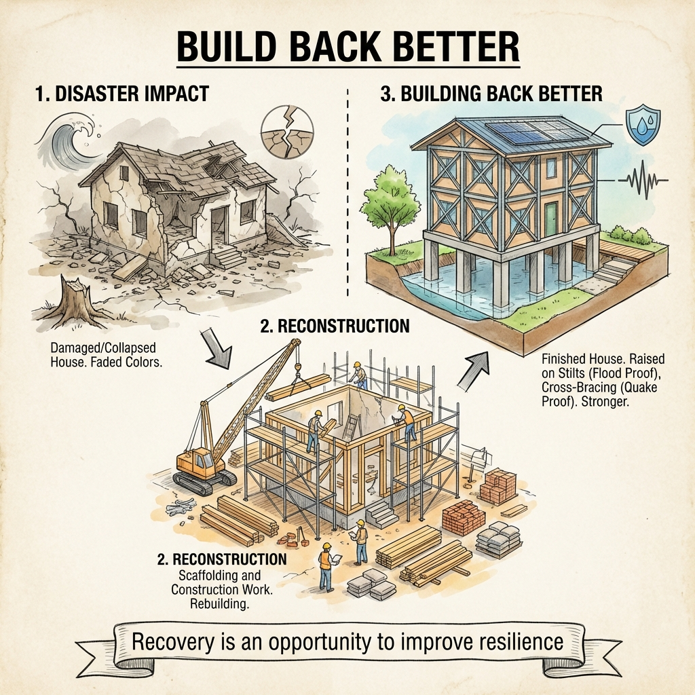

# Post-Disaster Planning and Development

The post-disaster phase focuses on recovery, rehabilitation, and reconstruction.

## 1. Rehabilitation (Short to Medium Term)

* Restoration of essential services.
* **Post-Disaster Needs Assessment (PDNA):** A standard methodology used by the UN, World Bank, and EU to assess damage and recovery needs.
  * *Guide:* [PDNA Guidelines Vol. A](https://www.undp.org/publications/post-disaster-needs-assessment-pdna-guidelines-volume)

## 2. Reconstruction (Long Term)

* **Build Back Better (BBB):** The use of the recovery, rehabilitation and reconstruction phases after a disaster to increase the resilience of nations and communities through integrating disaster risk reduction measures into the restoration of physical infrastructure and societal systems.
  * *Source:* [Sendai Framework Definition of BBB](https://www.undrr.org/implementing-sendai-framework/what-sendai-framework)

*Fig 1: The Concept of Building Back Better (BBB).*

## 3. Development

* Disasters often open a window of opportunity for development reforms.
* **Gujarat Earthquake (2001):** The reconstruction program led to a complete overhaul of the state's infrastructure and disaster management laws (GSDMA Act 2003).

### Related Articles

* **Odisha's Recovery:** How Odisha rebuilt after the 1999 Super Cyclone.  
  * *Article:* [From Despair to Model of Management (World Bank)](https://www.worldbank.org/en/news/feature/2013/10/17/odisha-disaster-management-success-story)

---

## 📝 Self Assessment

### Multiple Choice Questions

1. **Rehabilitation typically refers to the \_\_\_\_\_\_ term recovery.**
    

    
Click to show Options

    a) Short to Medium 
    b) Very Long 
    c) Pre-disaster 
    d) Immediate (Minutes) 
    

    

    
Click to show Answer

    **Correct Answer:** a) Short to Medium
    

2. **"Build Back Better" (BBB) aims to:**
    

    
Click to show Options

    a) Rebuild exactly as it was before. 
    b) Use cheaper materials to save money. 
    c) Increase resilience and reduce future risk during reconstruction. 
    d) Rebuild only government offices. 
    

    

    
Click to show Answer

    **Correct Answer:** c) Increase resilience and reduce future risk during reconstruction.
    

3. **PDNA stands for:**
    

    
Click to show Options

    a) Pre-Disaster Needs Assessment 
    b) Post-Disaster Needs Assessment 
    c) Public Disaster Notification Authority 
    d) Primary District National Assessment 
    

    

    
Click to show Answer

    **Correct Answer:** b) Post-Disaster Needs Assessment
    

4. **The reconstruction after which 2001 event is cited as a major development opportunity in India?**
    

    
Click to show Options

    a) Indian Ocean Tsunami 
    b) Gujarat (Bhuj) Earthquake 
    c) Kashmir Floods 
    d) Latur Earthquake 
    

    

    
Click to show Answer

    **Correct Answer:** b) Gujarat (Bhuj) Earthquake
    

5. **Reconstruction is distinct from Rehabilitation because it focuses on:**
    

    
Click to show Options

    a) Temporary shelters. 
    b) First Aid. 
    c) Permanent repair and long-term rebuilding. 
    d) Food distribution. 
    

    

    
Click to show Answer

    **Correct Answer:** c) Permanent repair and long-term rebuilding.
    

6. **Providing psychological counseling to trauma victims is part of:**
    

    
Click to show Options

    a) Mitigation 
    b) Rehabilitation (psycho-social support) 
    c) Prevention 
    d) Warning Dissemination 
    

    

    
Click to show Answer

    **Correct Answer:** b) Rehabilitation (psycho-social support)
    

7. **Restoring electricity and water supply immediately after a storm is considered:**
    

    
Click to show Options

    a) Restoration of Essential Services 
    b) Long-term Development 
    c) Mitigation 
    d) Preparedness 
    

    

    
Click to show Answer

    **Correct Answer:** a) Restoration of Essential Services
    

8. **The International bodies that standardized PDNA include:**
    

    
Click to show Options

    a) FIFA and IOC 
    b) UN, World Bank, and EU 
    c) NASA and ISRO 
    d) Facebook and Google 
    

    

    
Click to show Answer

    **Correct Answer:** b) UN, World Bank, and EU
    

9. **Odisha established OSDMA following which major disaster?**
    

    
Click to show Options

    a) 2001 Earthquake 
    b) 1999 Super Cyclone 
    c) 2004 Tsunami 
    d) 2013 Phailin 
    

    

    
Click to show Answer

    **Correct Answer:** b) 1999 Super Cyclone
    

10. **"Cash for Work" programs are often used during:**
    

    
Click to show Options

    a) Pre-disaster planning 
    b) Early recovery/Rehabilitation stages to restore livelihoods 
    c) Search and Rescue 
    d) Hazard Mapping 
    

    

    
Click to show Answer

    **Correct Answer:** b) Early recovery/Rehabilitation stages to restore livelihoods
    

### Descriptive Questions

1. **Differentiate between Rehabilitation and Reconstruction.**
    

    
Click to see Key Points

    *   **Rehabilitation:** Short/Medium term. Focus on restoring normalcy, essential services (water/power), and temporary housing.
    *   **Reconstruction:** Long term. Focus on permanent rebuilding of infrastructure, housing, and economy, ideally better than before.
    

2. **Explain the principle of "Build Back Better".**
    

    
Click to see Key Points

    *   It is a recovery approach that doesn't just restore what was there.
    *   It uses the reconstruction phase to integrate Disaster Risk Reduction (DRR).
    *   *Example:* Relocating a school to higher ground or using earthquake-resistant technology when rebuilding a collapsed school.
    

